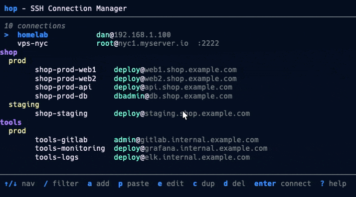
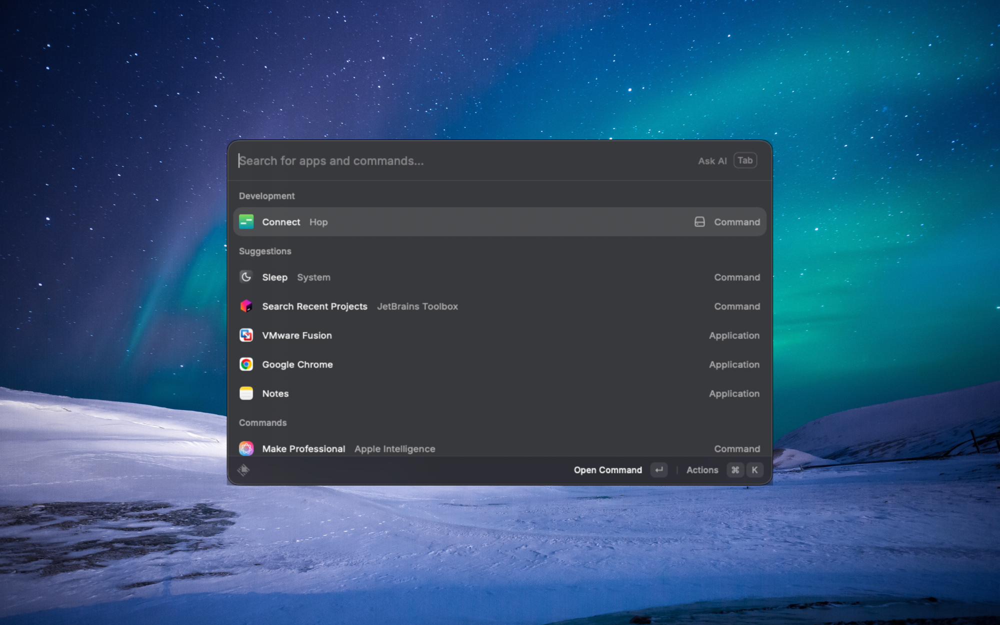
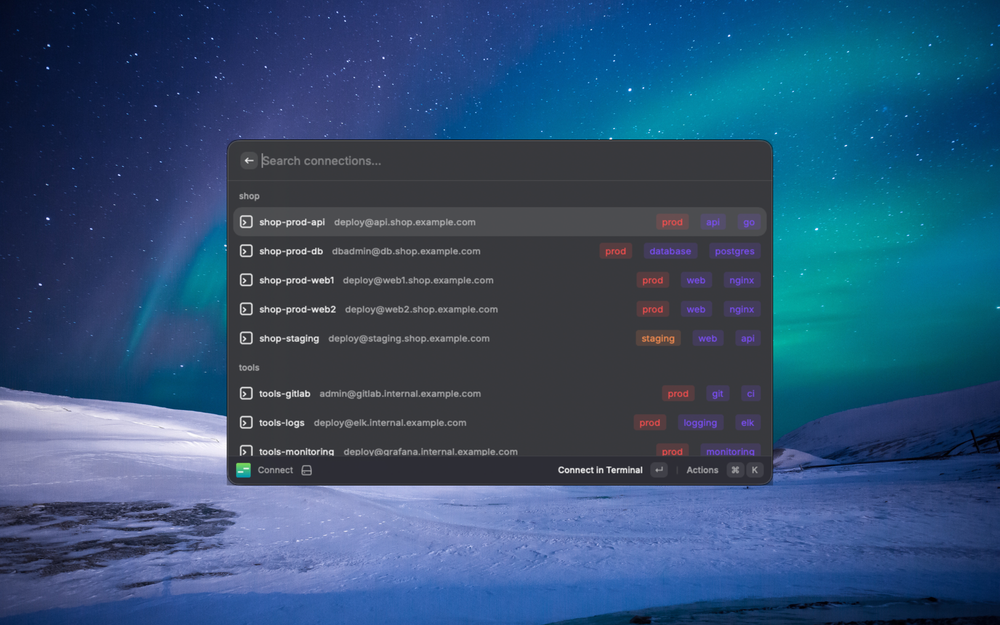
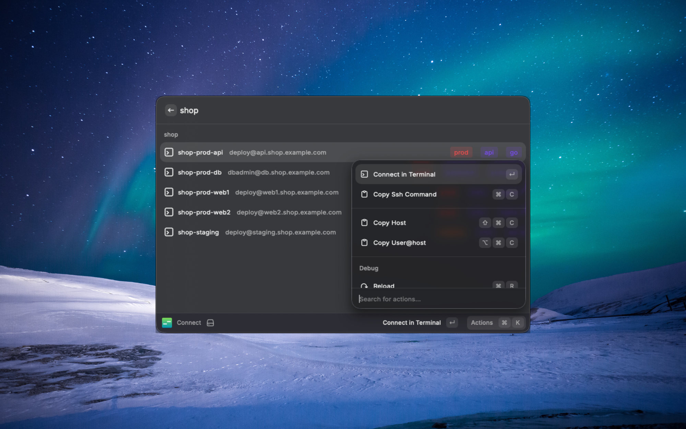

<p align="center">
  
</p>

<h1 align="center">hop</h1>

<p align="center">
  Stop typing long SSH commands. Just <code>hop prod</code> and you're in.
</p>

<p align="center">
  
</p>

## Why hop?

```bash
# Before: remembering and typing this every time
ssh -i ~/.ssh/work_key deploy@app-server-prod-03.us-east-1.example.com -p 2222

# After
hop prod
```

```bash
hop prod                         # fuzzy match any server
hop exec production "uptime"     # run command on all prod servers
hop import                       # import your existing ~/.ssh/config
hop                              # launch the TUI, manage everything
```

## Install

```bash
go install github.com/danmartuszewski/hop/cmd/hop@latest
```

Or build from source:

```bash
git clone https://github.com/danmartuszewski/hop.git && cd hop && make build
./bin/hop
```

## Features

- **Fuzzy matching** - Type `hop prod` to connect to `app-server-prod-03`
- **TUI dashboard** - Browse, add, edit, delete connections with keyboard or mouse
- **SSH config import** - Already have servers in `~/.ssh/config`? Import them in one command
- **Export** - Export filtered connections to YAML for sharing or backup
- **Multi-exec** - Run commands across multiple servers at once
- **Groups & tags** - Organize by project, environment, or custom tags
- **Jump hosts** - ProxyJump support for bastion servers
- **Zero dependencies** - Single binary, works anywhere

## Coming Soon: Raycast Extension

Launch connections directly from Raycast. Fuzzy search, tags, environments - all at your fingertips.

<p align="center">
  
  
  
</p>

## Configuration

Config file location: `~/.config/hop/config.yaml`

```yaml
version: 1

defaults:
  user: admin
  port: 22

connections:
  - id: prod-web
    host: web.example.com
    user: deploy
    project: myapp
    env: production
    tags: [web, prod]

  - id: prod-db
    host: db.example.com
    user: dbadmin
    port: 5432
    project: myapp
    env: production
    tags: [database, prod]

  - id: staging
    host: staging.example.com
    user: deploy
    project: myapp
    env: staging

  - id: private-server
    host: 10.0.1.50
    user: admin
    proxy_jump: bastion          # Connect via jump host
    forward_agent: true          # Forward SSH agent

groups:
  production: [prod-web, prod-db]
  web-servers: [prod-web, staging]
```

> **Security note:** `forward_agent: true` exposes your SSH keys to anyone with root access on the remote server. Only enable this for servers you fully trust. Consider using `proxy_jump` instead when you just need to reach internal hosts through a bastion.

## TUI Dashboard

Launch with `hop` or `hop dashboard`.

### Keyboard Shortcuts

| Key | Action |
|-----|--------|
| `↑/k` | Move up |
| `↓/j` | Move down |
| `g` | Go to top |
| `G` | Go to bottom |
| `/` | Filter connections |
| `t` | Filter by tags |
| `r` | Toggle sort by recent |
| `Enter` | Connect to selected |
| `a` | Add new connection |
| `i` | Import from SSH config |
| `p` | Paste SSH string (quick add) |
| `e` | Edit selected |
| `c` | Duplicate selected |
| `d` | Delete selected |
| `x` | Export connections to YAML |
| `y` | Copy SSH command |
| `?` | Show help |
| `q` | Quit |

### Quick Add with Paste

Press `p` and paste any of these formats:

```
user@host.com
user@host.com:2222
ssh user@host.com -p 2222
ssh://user@host:port
```

The connection form opens with fields pre-filled.

### Importing from SSH Config

Import existing connections from your `~/.ssh/config` file:

**From the dashboard:** Press `i` to open the import modal, select which connections to import, and press Enter.

**From the CLI:**
```bash
hop import                   # Import from ~/.ssh/config
hop import --dry-run         # Preview what would be imported
hop import --file ~/.ssh/config.d/work  # Import from custom path
```

**What gets imported:**
- Host alias becomes the connection ID
- HostName, User, Port, IdentityFile
- ProxyJump for jump host connections
- ForwardAgent setting

**What gets skipped:**
- Wildcard patterns (`Host *`, `Host *.example.com`)
- Entries without a HostName (alias is used as hostname)

**Conflict handling:** If a connection ID already exists, the imported connection is renamed with `-imported` suffix (e.g., `myserver` → `myserver-imported`).

### Exporting Connections

Export a subset of connections to a YAML file for sharing, backup, or transferring to another machine.

**From the dashboard:** Press `x` to open the export modal. Only currently filtered connections are shown — apply text or tag filters first to narrow the selection. Toggle items with Space, then press Enter to save.

**From the CLI:**
```bash
hop export --all                          # Export all to stdout
hop export --all -o backup.yaml           # Export all to a file
hop export --project myapp -o myapp.yaml  # Export by project
hop export --tag database                 # Export by tag
hop export --env production               # Export by environment
hop export --id web-1,web-2              # Export specific connections
```

At least one filter flag or `--all` is required. Filters combine with AND logic.

## CLI Commands

```bash
hop                          # Open TUI dashboard
hop <query>                  # Fuzzy match and connect
hop connect <id>             # Connect by exact ID
hop list                     # List all connections
hop list --json              # List as JSON
hop list --flat              # Flat list without grouping
hop import                   # Import from ~/.ssh/config
hop import --file <path>     # Import from custom path
hop import --dry-run         # Preview without importing
hop export --all             # Export all connections to stdout
hop export --project <name>  # Export filtered connections
hop export --tag <tag> -o f  # Export to file
hop open <target...>         # Open multiple terminal tabs
hop exec <target> "cmd"      # Execute command on multiple servers
hop resolve <target>         # Test which connections a target matches
hop version                  # Show version
```

### Targeting

Commands like `exec` and `open` accept a **target** that resolves to one or more connections. The target is matched in this order:

1. **Named group** — an explicit list of connection IDs defined under `groups:` in config
2. **Project-env pattern** — matches connections by `project` and `env` fields (e.g. `myapp-prod` matches all connections with `project: myapp` and `env: prod`)
3. **Glob pattern** — wildcard matching on connection IDs (e.g. `web*`, `*-prod-*`)
4. **Fuzzy match** — falls back to fuzzy matching a single connection ID

You can also filter any target by tag with `--tag`.

Use `hop resolve` to preview which connections a target will match before running anything:

```bash
hop resolve production              # see what "production" resolves to
hop resolve "web*"                  # test a glob pattern
hop resolve myapp-prod --tag=web    # combine target + tag filter
```

### Examples

```bash
# Fuzzy connect
hop prod                # matches "prod-web", "prod-db", etc.
hop web                 # matches first *web* server

# Multi-exec with different target types
hop exec production "uptime"           # named group
hop exec myapp-prod "df -h"            # project-env pattern
hop exec "web*" "systemctl status"     # glob pattern
hop exec --tag=database "psql -c '\\l'" # tag filter

# Open multiple tabs
hop open production                    # named group
hop open web1 db1 api1                 # specific IDs
hop open myapp-prod -- "htop"          # with initial command

# List connections
hop list --flat
```

## Shell Completions

```bash
# Bash (Linux)
hop completion bash | sudo tee /etc/bash_completion.d/hop > /dev/null

# Bash (macOS with Homebrew)
hop completion bash > $(brew --prefix)/etc/bash_completion.d/hop

# Zsh (add to ~/.zshrc)
source <(hop completion zsh)

# Fish
hop completion fish > ~/.config/fish/completions/hop.fish
```

## Flags

```bash
-c, --config <path>    # Use custom config file
-v, --verbose          # Verbose output
-q, --quiet            # Suppress non-essential output
    --dry-run          # Print SSH command without executing
```

## Building

```bash
make build          # Build binary to ./bin/hop
make test           # Run tests
make test-docker    # Run tests in Docker (isolated)
make install        # Install to $GOPATH/bin
make docker         # Build Docker image
```

## Docker

```bash
# Build image
docker build -t hop .

# Run interactively
docker run -it --rm hop

# Run tests in container
docker build --target tester -t hop-test .
```

## Project Structure

```
hop/
├── cmd/hop/           # Main entry point
├── internal/
│   ├── cmd/           # CLI commands (cobra)
│   ├── config/        # Configuration loading/saving
│   ├── export/        # Export logic
│   ├── fuzzy/         # Fuzzy matching
│   ├── picker/        # Connection picker (promptui)
│   ├── ssh/           # SSH connection handling
│   ├── sshconfig/     # SSH config parsing
│   └── tui/           # TUI dashboard (bubbletea)
├── Dockerfile
├── Makefile
└── README.md
```

## License

MIT License - see [LICENSE](LICENSE) for details.
