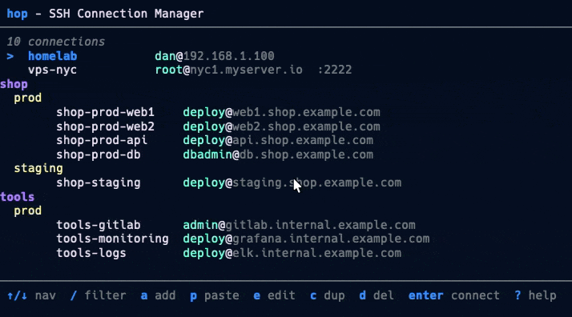
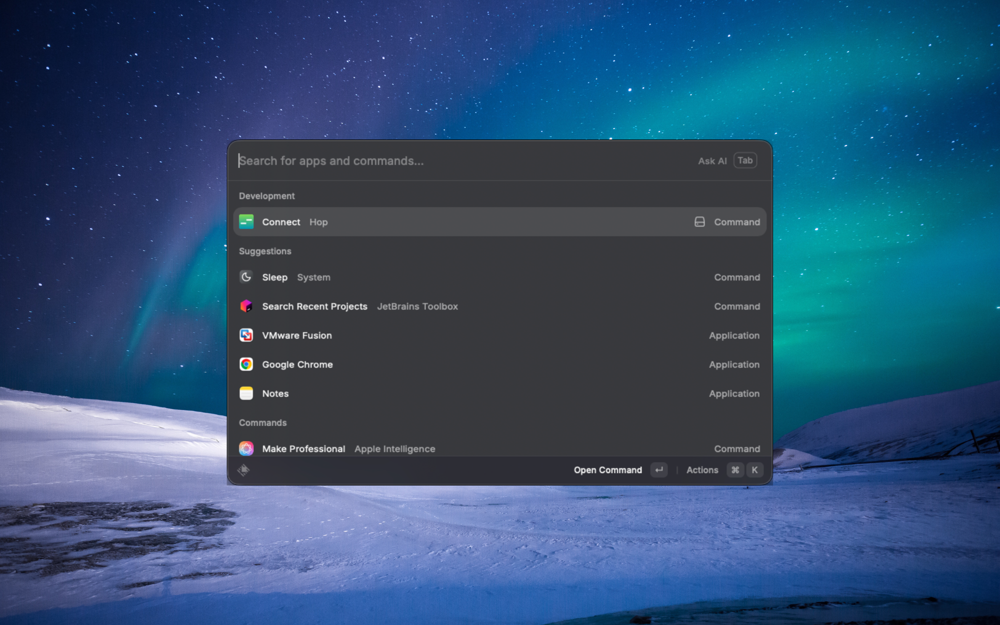
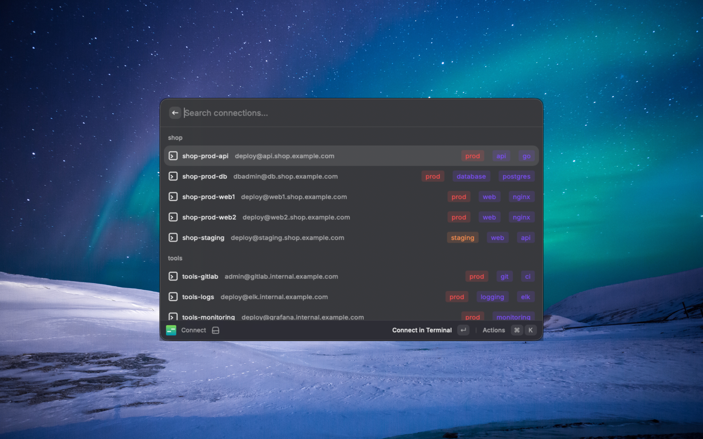
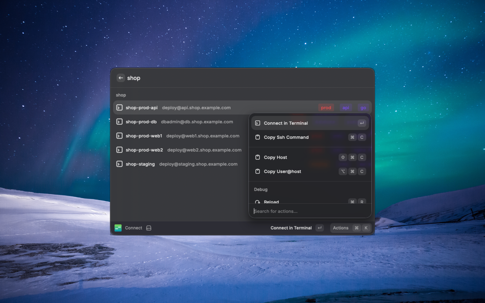
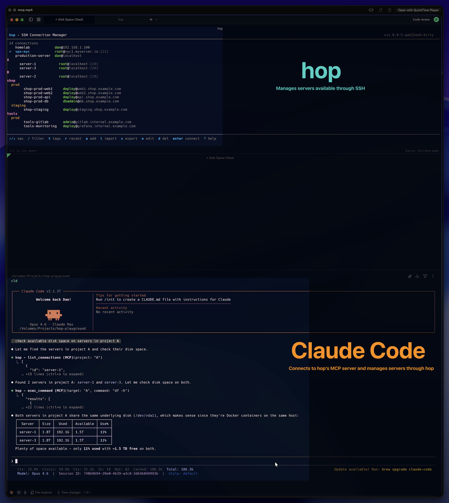

<p align="center">
  
</p>

<h1 align="center">hop</h1>

<p align="center">
  Stop typing long SSH commands. Just <code>hop prod</code> and you're in.
</p>

<p align="center">
  
</p>

## Why hop?

```bash
# Before: remembering and typing this every time
ssh -i ~/.ssh/work_key deploy@app-server-prod-03.us-east-1.example.com -p 2222

# After
hop prod
```

```bash
hop prod                         # fuzzy match any server
hop exec production "uptime"     # run command on all prod servers
hop import                       # import your existing ~/.ssh/config
hop                              # launch the TUI, manage everything
```

## Install

### Homebrew (macOS/Linux)

```bash
brew install danmartuszewski/tap/hop
```

### Go

```bash
go install github.com/danmartuszewski/hop/cmd/hop@latest
```

### From source

```bash
git clone https://github.com/danmartuszewski/hop.git && cd hop && make build
./bin/hop
```

### Install with an AI agent

Using Claude Code, Codex, Cursor, or another coding agent? Paste the block below into your agent and it will pick the right install path for your machine, register hop's MCP server, and verify the install.

```text
Install hop on this machine and register its MCP server. Do the steps in order;
stop and report on the first failure.

1. Pick ONE install method, in this priority:
   a. Homebrew (macOS or Linux):
        brew install danmartuszewski/tap/hop
   b. Go 1.22+ available:
        go install github.com/danmartuszewski/hop/cmd/hop@latest
   c. From source (no brew, no Go on PATH):
        git clone https://github.com/danmartuszewski/hop.git && cd hop && make install

2. Verify the binary is on PATH:
        hop version

3. Register the MCP server with whichever agent the user is running. Skip
   clients the user does not use:
   - Claude Code:  claude mcp add hop -- hop mcp
   - Codex CLI:    codex mcp add hop -- hop mcp
   - Claude Desktop / Cursor / Windsurf — add to the client's MCP config:
        { "hop": { "command": "hop", "args": ["mcp"] } }

4. (Optional) Seed the config from the user's existing SSH config. Preview
   first; --yes is required for a non-interactive run:
        hop import --dry-run
        hop import --yes

5. Confirm hop's MCP tools are reachable from the agent (e.g. list_connections).

Constraints:
- Do NOT run bare `hop` — it launches an interactive TUI and will hang a
  non-interactive session. Use subcommands (`hop version`, `hop list`, …).
- Do NOT modify ~/.ssh/config. hop reads it via `hop import` only.
- Do NOT commit secrets or identity files.

After step 3, restart the agent so it picks up the new MCP server.
```

## Features

- **Fuzzy matching** - Type `hop prod` to connect to `app-server-prod-03`
- **TUI dashboard** - Browse, add, edit, delete connections with keyboard or mouse
- **SSH config import** - Already have servers in `~/.ssh/config`? Import them in one command
- **Export** - Export filtered connections to YAML for sharing or backup
- **Multi-exec** - Run commands across multiple servers at once
- **Groups & tags** - Organize by project, environment, or custom tags
- **Jump hosts** - ProxyJump support for bastion servers
- **MCP server** - Let AI assistants manage your servers — search connections, run commands, check status across projects
- **Mosh support** - Use [mosh](https://mosh.org/) instead of SSH for roaming and unreliable connections
- **Zero dependencies** - Single binary, works anywhere

> **See all features in action:** [Demo recordings](demo/DEMOS.md)

## Raycast Extension

Launch connections directly from Raycast. Fuzzy search, tags, environments - all at your fingertips.

[Install from Raycast Store](https://www.raycast.com/danmartuszewski/hop)

<p align="center">
  
  
  
</p>

## Configuration

Config file location: `~/.config/hop/config.yaml`

```yaml
version: 1

defaults:
  user: admin
  port: 22
  # use_mosh: true             # Uncomment to use mosh for all connections

connections:
  - id: prod-web
    host: web.example.com
    user: deploy
    project: myapp
    env: production
    tags: [web, prod]

  - id: prod-db
    host: db.example.com
    user: dbadmin
    port: 5432
    project: myapp
    env: production
    tags: [database, prod]

  - id: staging
    host: staging.example.com
    user: deploy
    project: myapp
    env: staging

  - id: private-server
    host: 10.0.1.50
    user: admin
    proxy_jump: bastion          # Connect via jump host
    forward_agent: true          # Forward SSH agent

  - id: remote-dev
    host: dev.example.com
    user: dan
    use_mosh: true               # Use mosh instead of SSH

groups:
  production: [prod-web, prod-db]
  web-servers: [prod-web, staging]
```

> **Security note:** `forward_agent: true` exposes your SSH keys to anyone with root access on the remote server. Only enable this for servers you fully trust. Consider using `proxy_jump` instead when you just need to reach internal hosts through a bastion.

### Mosh Support

[Mosh](https://mosh.org/) (mobile shell) is useful for connections over unreliable networks — it handles roaming, intermittent connectivity, and high latency gracefully.

**Global default** — enable mosh for all connections:

```yaml
defaults:
  use_mosh: true

connections:
  - id: remote-dev
    host: dev.example.com

  - id: legacy-server
    host: old.example.com
    use_mosh: false              # Override: use SSH for this one
```

**Per-connection** — enable mosh for specific connections:

```yaml
connections:
  - id: remote-dev
    host: dev.example.com
    user: dan
    use_mosh: true
```

**One-off** — use the `--mosh` flag without changing config:

```bash
hop connect myserver --mosh
hop myserver --mosh
```

Per-connection `use_mosh: false` overrides the global default. SSH options (port, identity file, proxy jump, agent forwarding) are automatically passed to mosh via its `--ssh` flag. Mosh requires both the local `mosh-client` and `mosh-server` on the remote host.

> **Note:** `hop exec` always uses SSH regardless of `use_mosh`, since mosh is designed for interactive sessions.

## TUI Dashboard

Launch with `hop` or `hop dashboard`.

When you connect to a server from the dashboard (by pressing Enter), the SSH session starts, and **the dashboard automatically returns after the session ends**. This lets you quickly hop between servers without restarting the TUI each time.

For one-shot connections that exit to your terminal, use:
```bash
hop <query>           # fuzzy match and connect
hop connect <id>      # connect by exact ID
```

### Keyboard Shortcuts

| Key | Action |
|-----|--------|
| `↑/k` | Move up |
| `↓/j` | Move down |
| `PgUp/PgDn` | Move by page |
| `g` | Go to top |
| `G` | Go to bottom |
| `/` | Filter connections (supports multi-keyword AND search) |
| `t` | Filter by tags |
| `r` | Toggle sort by recent |
| `Enter` | Connect to selected |
| `a` | Add new connection |
| `i` | Import from SSH config |
| `p` | Paste SSH string (quick add) |
| `e` | Edit selected |
| `c` | Duplicate selected |
| `d` | Delete selected |
| `x` | Export connections to YAML |
| `y` | Copy SSH command |
| `T` | Open theme picker |
| `?` | Show help |
| `q` | Quit |

### Filtering Connections

Press `/` to filter connections by typing keywords. The filter supports **multi-keyword AND logic** - separate keywords with spaces to find connections matching all terms.

**Examples:**
- `prod` - matches connections containing "prod"
- `prod web` - matches connections containing both "production" AND "web"
- `kaf staging` - matches connections with both "kafka" AND "staging"

The filter searches across connection IDs, hosts, projects, environments, and tags.

### Quick Add with Paste

Press `p` and paste any of these formats:

```
user@host.com
user@host.com:2222
ssh user@host.com -p 2222
ssh://user@host:port
```

The connection form opens with fields pre-filled.

### Importing from SSH Config

Import existing connections from your `~/.ssh/config` file:

**From the dashboard:** Press `i` to open the import modal, select which connections to import, and press Enter.

**From the CLI:**
```bash
hop import                   # Import from ~/.ssh/config
hop import --dry-run         # Preview what would be imported
hop import --file ~/.ssh/config.d/work  # Import from custom path
```

**What gets imported:**
- Host alias becomes the connection ID
- HostName, User, Port, IdentityFile
- ProxyJump for jump host connections
- ForwardAgent setting

**What gets skipped:**
- Wildcard patterns (`Host *`, `Host *.example.com`)
- Entries without a HostName (alias is used as hostname)

**Conflict handling:** If a connection ID already exists, the imported connection is renamed with `-imported` suffix (e.g., `myserver` → `myserver-imported`).

### Exporting Connections

Export a subset of connections to a YAML file for sharing, backup, or transferring to another machine.

**From the dashboard:** Press `x` to open the export modal. Only currently filtered connections are shown — apply text or tag filters first to narrow the selection. Toggle items with Space, then press Enter to save.

**From the CLI:**
```bash
hop export --all                          # Export all to stdout
hop export --all -o backup.yaml           # Export all to a file
hop export --project myapp -o myapp.yaml  # Export by project
hop export --tag database                 # Export by tag
hop export --env production               # Export by environment
hop export --id web-1,web-2              # Export specific connections
```

At least one filter flag or `--all` is required. Filters combine with AND logic.

### Theming

The dashboard ships with sixteen color presets — each popular theme has both a dark and a light variant, listed separately so you can pick whichever you want regardless of your terminal background. Press `T` to browse them with live preview: `↑/↓` to navigate, `Enter` to save the choice into your config, `Esc` to revert.

| Family | Dark | Light |
|---|---|---|
| Built-in hop | `default-dark` | `default-light` |
| Everforest | `everforest-dark` | `everforest-light` |
| Gruvbox | `gruvbox-dark` | `gruvbox-light` |
| Catppuccin | `catppuccin-mocha` | `catppuccin-latte` |
| Tokyo Night | `tokyo-night-storm` | `tokyo-night-day` |
| Solarized | `solarized-dark` | `solarized-light` |
| Nord | `nord` | `nord-light` |
| Dracula | `dracula` | `alucard` |

Picking a preset writes a single line to your config:

```yaml
theme_preset: everforest-dark
```

When `theme_preset` is unset, hop auto-picks `default-dark` or `default-light` based on your terminal background.

#### Custom overrides

Layer your own colors on top of any preset:

```yaml
theme_preset: everforest-dark   # optional; omit to auto-pick default
theme:                          # applies to every preset
  primary: "#0066cc"
theme_dark:                     # only applies when the preset is a dark variant
  selection: "#1f1f28"
theme_light:                    # only applies when the preset is a light variant
  foreground: "#1c1f24"
```

Color values can be either a quoted ANSI 256 code (`"39"`) or a hex string (`"#bd93f9"`). ANSI codes adapt to your terminal's palette; hex values are absolute.

Available keys: `primary`, `secondary`, `accent`, `success`, `warning`, `error`, `muted`, `selection`, `foreground`. Any key you don't set falls through to the preset, then to the built-in default.

## CLI Commands

```bash
hop                          # Open TUI dashboard
hop <query>                  # Fuzzy match and connect
hop connect <id>             # Connect by exact ID
hop get <id> <field>         # Print single field value to stdout
hop get <id> f1,f2,f3        # Print multiple fields tab-separated
hop get <id>                 # Print all fields as "key value" lines
hop get --help               # Full field list and flags
hop list                     # List all connections
hop list --json              # List as JSON
hop list --flat              # Flat list without grouping
hop import                   # Import from ~/.ssh/config
hop import --file <path>     # Import from custom path
hop import --dry-run         # Preview without importing
hop export --all             # Export all connections to stdout
hop export --project <name>  # Export filtered connections
hop export --tag <tag> -o f  # Export to file
hop open <target...>         # Open multiple terminal tabs
hop exec <target> "cmd"      # Execute command on multiple servers
hop resolve <target>         # Test which connections a target matches
hop mcp                      # Start MCP server (read-only)
hop mcp --allow-exec         # Start MCP server with remote exec
hop version                  # Show version
```

### Targeting

Commands like `exec` and `open` accept a **target** that resolves to one or more connections. The target is matched in this order:

1. **Named group** — an explicit list of connection IDs defined under `groups:` in config
2. **Project-env pattern** — matches connections by `project` and `env` fields (e.g. `myapp-prod` matches all connections with `project: myapp` and `env: prod`)
3. **Glob pattern** — wildcard matching on connection IDs (e.g. `web*`, `*-prod-*`)
4. **Fuzzy match** — falls back to fuzzy matching a single connection ID

You can also filter any target by tag with `--tag`.

Use `hop resolve` to preview which connections a target will match before running anything:

```bash
hop resolve production              # see what "production" resolves to
hop resolve "web*"                  # test a glob pattern
hop resolve myapp-prod --tag=web    # combine target + tag filter
```

### Examples

```bash
# Fuzzy connect
hop prod                # matches "prod-web", "prod-db", etc.
hop web                 # matches first *web* server

# Multi-exec with different target types
hop exec production "uptime"           # named group
hop exec myapp-prod "df -h"            # project-env pattern
hop exec "web*" "systemctl status"     # glob pattern
hop exec --tag=database "psql -c '\\l'" # tag filter

# Open multiple tabs
hop open production                    # named group
hop open web1 db1 api1                 # specific IDs
hop open myapp-prod -- "htop"          # with initial command

# List connections
hop list --flat
```

### Scripting with hop

`hop get` prints connection fields to stdout so you can drop them straight into shell pipelines and command substitutions — think of it as `ssh -G` for your hop config.

```bash
# Build an ssh invocation from config:
ssh -i "$(hop get prod identity_file)" "$(hop get prod user)@$(hop get prod host)"
```

```bash
# Read multiple fields at once (tab-separated):
IFS=$'\t' read -r host port user < <(hop get prod host,port,user)
```

```bash
# Fallback when a field is empty:
hop get prod port --default 22
```

```bash
# Strict shells: suppress the trailing newline.
hop get prod host -n
```

```bash
# Dump all non-empty scalar fields (ssh -G style "key value" lines):
hop get prod
```

```bash
# Read a single SSH option by key:
hop get prod options.StrictHostKeyChecking
```

```bash
# Structured output for jq and friends:
hop get prod host,port --json | jq -r .host
```

**Matching is exact ID only** (not fuzzy) — safer inside scripts. Unknown IDs exit 1 with a "did you mean" hint. See `hop get --help` for the full field list.

## MCP Server (AI Assistant Integration)

hop includes a built-in [Model Context Protocol](https://modelcontextprotocol.io/) server that lets AI assistants like Claude Code and Codex manage your servers directly. Ask your assistant to check disk space across production, restart a service on staging, or find which servers belong to a project — it discovers your connections, resolves targets, and executes commands through hop.

<p align="center">
  
</p>

### Setup

**Claude Code:**
```bash
claude mcp add hop -- hop mcp
```

**Codex CLI:**
```bash
codex mcp add hop -- hop mcp
```

**Claude Desktop** — add to your config (`~/Library/Application Support/Claude/claude_desktop_config.json`):
```json
{
  "mcpServers": {
    "hop": {
      "command": "hop",
      "args": ["mcp"]
    }
  }
}
```

**Codex** — add to `~/.codex/config.toml`:
```toml
[mcp_servers.hop]
command = "hop"
args = ["mcp"]
```

Or generate the Claude Desktop config automatically:
```bash
hop mcp --print-client-config                  # read-only
hop mcp --print-client-config --allow-exec     # with remote exec enabled
```

### Tools

By default, only read-only tools are exposed:

| Tool | Description |
|------|-------------|
| `list_connections` | List connections, filter by project/env/tag |
| `search_connections` | Fuzzy search across all connections |
| `get_connection` | Get details for a specific connection |
| `resolve_target` | Preview how a target pattern resolves |
| `list_groups` | List all named groups |
| `get_history` | Connection usage history |
| `build_ssh_command` | Build the full SSH command string |

To enable remote command execution, start with `--allow-exec`:

```bash
claude mcp add hop -- hop mcp --allow-exec
codex mcp add hop -- hop mcp --allow-exec
```

This adds the `exec_command` tool, which runs shell commands on matched servers with output limits (64KB/host, 50 hosts max).

### Resources

The server also exposes browsable resources:

| URI | Description |
|-----|-------------|
| `hop://config` | Config summary (counts, projects, environments) |
| `hop://connections` | All connections |
| `hop://connections/{id}` | Individual connection details |
| `hop://groups` | All groups and members |

### Security

- Identity files (SSH key paths) are never exposed through MCP
- Remote execution is disabled by default and requires explicit `--allow-exec`
- All logging goes to stderr to keep the JSON-RPC transport clean

## Shell Completions

```bash
# Bash (Linux)
hop completion bash | sudo tee /etc/bash_completion.d/hop > /dev/null

# Bash (macOS with Homebrew)
hop completion bash > $(brew --prefix)/etc/bash_completion.d/hop

# Zsh (add to ~/.zshrc)
source <(hop completion zsh)

# Fish
hop completion fish > ~/.config/fish/completions/hop.fish
```

## Flags

```bash
-c, --config <path>    # Use custom config file
-v, --verbose          # Verbose output
-q, --quiet            # Suppress non-essential output
    --dry-run          # Print SSH command without executing
    --mosh             # Use mosh instead of SSH for this connection
```

## Building

```bash
make build          # Build binary to ./bin/hop
make test           # Run tests
make test-docker    # Run tests in Docker (isolated)
make install        # Install to $GOPATH/bin
make docker         # Build Docker image
```

## Docker

```bash
# Build image
docker build -t hop .

# Run interactively
docker run -it --rm hop

# Run tests in container
docker build --target tester -t hop-test .
```

## Project Structure

```
hop/
├── cmd/hop/           # Main entry point
├── internal/
│   ├── cmd/           # CLI commands (cobra)
│   ├── config/        # Configuration loading/saving
│   ├── export/        # Export logic
│   ├── fuzzy/         # Fuzzy matching
│   ├── mcp/           # MCP server (tools, resources, types)
│   ├── picker/        # Connection picker (promptui)
│   ├── resolve/       # Target resolution logic
│   ├── ssh/           # SSH connection handling
│   ├── sshconfig/     # SSH config parsing
│   └── tui/           # TUI dashboard (bubbletea)
├── Dockerfile
├── Makefile
└── README.md
```

## License

MIT License - see [LICENSE](LICENSE) for details.
