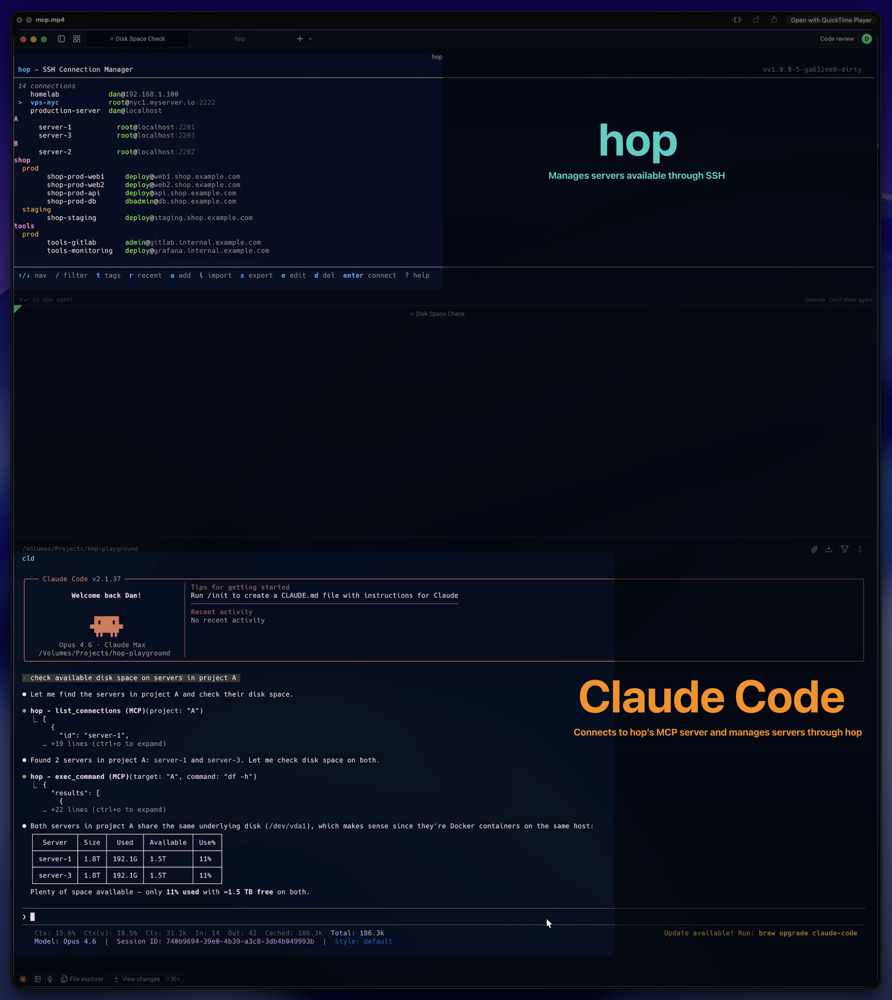

# Demos

Short demo recordings showcasing hop's features. Each demo is a self-contained GIF generated with [VHS](https://github.com/charmbracelet/vhs).

## Quick Connect

**Before/after:** Stop typing long SSH commands. Just `hop prod` and you're in.


## TUI Dashboard

**Browse and navigate your connections.** The full TUI with keyboard shortcuts, copy SSH command, and built-in help.


## Import SSH Config

**One command to import all your servers.** Existing `~/.ssh/config` entries are imported with identity files, proxy jumps, and agent forwarding preserved.


## Multi-exec

**Run commands across servers in parallel.** Target by named groups, glob patterns, or tags. Stream output in real-time.


## Manage Connections

**Add, paste, edit, delete** — all from the keyboard. Paste an SSH command and the form auto-fills.


## Search & Filter

**Find any server instantly.** Multi-keyword AND search, tag filtering, or combine both.


## MCP Server

**Let AI manage your servers.** Claude Code connects to hop's MCP server, finds servers by project, and checks disk space across them — all from a natural language request.



---

## Regenerating

See [demo/README.md](README.md) for prerequisites and instructions.

```bash
./demo/generate.sh
```
